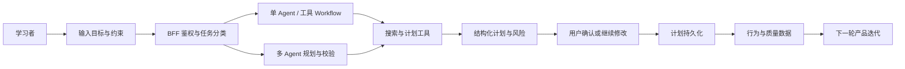
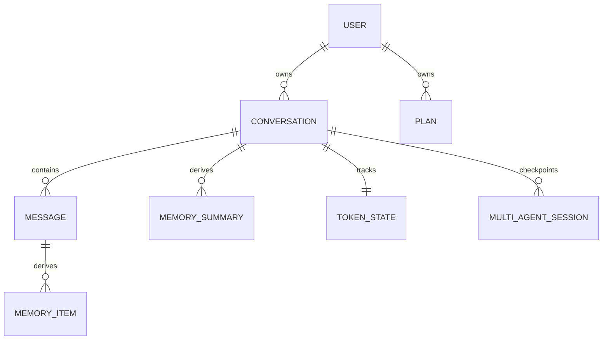

# AI Agent 兴趣教练 PRD（面试版）

> 项目仓库：[Erica-cod/ByteDanceAiAgentProject](https://github.com/Erica-cod/ByteDanceAiAgentProject)
>
> 结构来源：[字节 PRD 模版](https://bytedance.larkoffice.com/wiki/wikcn41TXk5A4uDjZcInEy4VwCx)

## 文档使用说明

本文用于 AI Agent 与全栈软件开发类岗位面试，目标不是把技术文档重新罗列一遍，而是说明：

1. 为什么要做这个产品；
2. 目标用户在什么场景遇到了什么问题；
3. 哪些功能已经实现，哪些仍是产品假设或生产化规划；
4. 如何用数据验证产品价值，而不只证明系统“能运行”。

证据状态统一使用以下标记：

- **[已实现]**：当前主分支有可定位代码或测试。
- **[已配置]**：仓库有部署、监控或流水线配置，但不等于已经在公网生产环境长期运行。
- **[待验证]**：有明确方案，尚缺真实用户、线上样本或稳定基线。
- **[规划]**：尚未实现，不作为当前项目成果。

## 版本修订记录

| 修订时间 | 版本 | 修订内容 |
| --- | --- | --- |
| 2026-07-28 | v0.1 | 基于现有代码反向整理产品定位、功能范围与证据边界 |
| 面试前待补 | v0.2 | 补充 3～5 位目标用户访谈、Demo 录屏和指标基线 |

## 1. 需求分析

### 1.1 背景

自主学习者经常面临三类问题：

1. **目标不够可执行**：用户知道自己想学 IELTS、前端或摄影，但难以拆成带时间、优先级和依赖关系的任务。
2. **计划缺少校验**：普通聊天模型容易直接给出看似完整的计划，却不会主动检查时间是否现实、资源是否可得、关键风险是否遗漏。
3. **多轮调整容易丢失约束**：当用户改变备考周期、可用时间或目标分数时，系统需要记住旧计划和长期偏好，而不是每次从头开始。

因此，本项目将产品定位为：

> 面向自主学习者的 AI 兴趣教练。它不仅回答问题，还能检索信息、生成和维护结构化计划，并通过 Planner、Critic、Host、Reporter 的协作链路检查方案风险。

用户价值不是“看见多个 Agent 在讨论”，而是获得一份更可执行、可调整、可追踪的学习计划。

### 1.2 用户分析

当前用户画像属于 **[待验证的产品假设]**，面试前需要通过真实访谈校准。

| 用户类型 | 典型特征 | 核心诉求 | 主要风险 |
| --- | --- | --- | --- |
| 目标明确但不会拆计划的学习者 | 有考试、求职或技能目标 | 将目标拆成阶段和任务 | 计划过于理想化 |
| 计划执行中发生变化的用户 | 时间、资源或优先级改变 | 在保留历史约束的前提下调整 | 系统忘记旧计划或错误覆盖 |
| 需要查资料再决策的用户 | 任务依赖外部最新信息 | 搜索、分析、生成计划一次完成 | 搜索后忘记继续执行后续工具 |

建议面试前完成 3～5 次、每次 15 分钟的轻量访谈：

1. 最近一次制定学习计划是什么目标？
2. 计划在哪一步失效，原因是什么？
3. 调整计划时最希望系统记住什么？
4. 会不会直接采用 AI 计划？采用前需要看到哪些依据？
5. 能接受多长等待时间？更重视速度还是风险校验？

没有完成访谈前，不把上述画像表述成“调研结论”。

### 1.3 业务场景分析

#### 场景 A：从模糊目标生成学习计划

用户输入目标、截止时间、每周可用时长和现有基础。系统生成阶段计划，Critic 检查可行性、现实性、完整性和高风险，Host 决定修订、验证或结束，Reporter 输出最终版本。

#### 场景 B：查资料后创建计划

用户说“搜索 IELTS 备考方法，然后根据结果帮我制定 8 个月计划”。系统需要完成：

```text
识别多步骤意图
→ 调用 search_web
→ 消费搜索结果
→ 调用 create_plan
→ 持久化结构化计划
→ 返回计划卡片与来源
```

#### 场景 C：调整已有计划

用户说“列出原来的 IELTS 计划；我的备考时间改为 8 个月，请搜索资料后更新计划”。系统需要连续完成：

```text
list_plans → search_web → update_plan → 返回更新后的计划
```

这类场景用于证明工具结果真正进入下一步，而不是只执行第一个工具后提前结束。

### 1.4 数据分析

#### 当前已有技术数据能力

**[已实现]**

- SSE：活跃连接、总连接、错误率。
- 模型：请求量、平均耗时、token 使用量、错误数。
- 数据库：查询次数、平均耗时、错误数。
- 工具：调用次数和错误数。
- 流式体验：TTFT、TTLB、TPS、stall、stream error。
- Web：HTTP 耗时、JS error、Web Vitals。

#### 当前缺少的产品数据

当前指标能回答“系统是否健康”，还不能充分回答“计划是否对用户有用”。需要补充：

- 计划生成后确认/保存率。
- 计划被二次修改的比例与原因。
- 任务开始率、完成率。
- 计划生成后的次日、七日回访。
- 用户取消生成、重试和放弃的节点。
- 单 Agent 与多 Agent 的完成率、质量、耗时和成本对比。

因此，当前不能宣称产品留存、用户满意度或商业转化已经得到验证。

### 1.5 历史功能分析

| 阶段 | 能力 | 主要问题 | 当前改进 |
| --- | --- | --- | --- |
| 单 Agent 对话 | 回答、搜索、计划工具 | 复杂任务容易漏步骤 | 工具链多轮执行与最大轮次 |
| 固定多 Agent | 固定执行 Planner、Critic、Host | Host 返回调度但下一轮未真正执行 | `next_agents` 成为真实调度指令 |
| 相似度收敛 | 用语义相似度判断是否结束 | “说得像”不等于正确 | 结构化质量门槛、高风险和覆盖率决定终止 |
| 最近窗口记忆 | 保留近期消息 | 旧目标和约束可能丢失 | 原文事实源 + 混合检索 + 派生摘要 + token 预算 |

### 1.6 竞品分析（面试简版）

| 方案 | 优势 | 局限 | 本项目取舍 |
| --- | --- | --- | --- |
| 通用聊天产品 | 使用门槛低、回答范围广 | 计划生命周期和工具结果难以审计 | 聚焦结构化计划与过程展示 |
| 固定计划模板 | 确定、快速、成本低 | 难适应开放目标和动态约束 | 确定性流程与模型语义能力结合 |
| 自由 Agent | 动态性强 | 容易循环、越权、不可复现 | Host 状态机、最大轮次、工具白名单 |
| 多 Agent | 可分工和交叉检查 | 延迟和 token 成本更高 | 复杂规划使用，简单问答走单 Agent |

## 2. 产品目标

### 2.1 产品定位

产品负责把用户的开放学习目标转化为可执行计划，并在目标变化时支持基于历史约束的调整。

产品边界：

- 不是课程内容平台。
- 不是替用户执行全部学习任务的自动化机器人。
- 不是成熟身份平台或企业级权限中台。
- 不承诺模型生成的计划一定正确，高风险决策必须保留用户确认。

### 2.2 定性目标

1. 用户能在一次会话中完成“查资料—生成计划—检查风险—保存计划”。
2. 计划调整时能够召回旧目标、偏好和约束。
3. 用户可以看到生成进度、角色意见和最终风险，而不是面对黑盒等待。
4. 模型、Embedding 或摘要任务失败时，主对话仍有可解释的降级路径。

### 2.3 定量目标

以下均为 **[待验证目标]**，不是当前已实现数据：

| 指标 | 口径 | 首版目标 |
| --- | --- | ---: |
| 固定任务集完成率 | 完整完成所有必要步骤的任务数 / 总任务数 | ≥ 90% |
| 工具调用成功率 | 成功返回有效结果的工具调用数 / 工具调用总数 | ≥ 95% |
| 最终结果可解析率 | Reporter 输出满足约定结构的次数 / 总生成次数 | ≥ 95% |
| 流式错误率 | stream error 数 / stream start 数 | < 1% |
| 云模型 TTFT P95 | 首 token 时间的 95 分位数 | ≤ 3 秒 |
| 计划确认率 | 用户明确确认或保存的计划数 / 完成生成的计划数 | 建立基线后设目标 |
| 单次完成成本 | 完成一次有效任务的平均 token 与模型成本 | 建立单 Agent 基线后优化 |

## 3. 需求综述

### 3.0 名词解释

| 名词 | 定义 |
| --- | --- |
| Planner | 生成或修订结构化计划 |
| Critic | 检查可行性、现实性、完整性和风险 |
| Host | 使用代码策略决定下一轮执行者和终止状态 |
| Reporter | 汇总最终结果并披露未解决风险 |
| Function Calling | 模型生成工具名与结构化参数，宿主程序校验并执行 |
| 事实源 | MongoDB `messages` 中的原始消息 |
| 派生记忆 | 可从原始消息重建的 `memory_items` 和 `memory_summaries` |
| token 双账本 | 分开记录累计计费量、当前输入压力和未摘要新增原文 |

### 3.1 整体思路

```text
用户目标与约束
→ BFF 鉴权、限流和输入校验
→ 简单任务：单 Agent / 工具 Workflow
→ 复杂规划：Planner + Critic + Host
→ Host 按风险与质量门槛真实调度下一轮
→ Reporter 输出最终结果
→ SSE 推送过程和最终结果
→ messages 同步保存原文
→ 后台生成 memory_items / memory_summaries
```

模型负责开放语义理解和生成；代码负责权限、工具执行、流程控制、最大轮次、Schema、降级和可观测性。

### 3.2 业务过程关系



### 3.3 实体关系



关键设计：

- `messages` 保存完整原文，是长期事实源。
- `memory_items` 面向切片、Embedding 和检索。
- `memory_summaries` 保存目标、偏好、约束以及来源消息 ID。
- `multi_agent_sessions` 是带 TTL 的短期执行检查点，不等同于完整企业级 run 审计表。

### 3.4 用户操作流程

```text
登录或 Demo 登录
→ 新建/选择会话
→ 选择本地/云模型
→ 选择单 Agent 或多 Agent
→ 输入目标、时间和约束
→ 观察流式生成与多 Agent 轮次
→ 查看计划卡片和风险
→ 继续修改、停止或重试
→ 回看历史会话与计划
```

### 3.5 需求列表

| 功能模块 | 需求编号及标题 | 优先级 | 状态 | 需求概述 |
| --- | --- | --- | --- | --- |
| 会话 | F01 会话生命周期 | P0 | 已实现 | 创建、查询、更新、删除、归档和历史加载 |
| 对话 | F02 SSE 流式生成 | P0 | 已实现 | 支持增量显示、取消、重试和错误态 |
| 计划 | F03 结构化计划工具 | P0 | 已实现 | 创建、查询、列表、更新计划 |
| Agent | F04 多 Agent 规划校验 | P0 | 已实现 | Planner、Critic、Host、Reporter 与动态调度 |
| 记忆 | F05 长会话记忆 | P0 | 已实现 | 原文事实源、混合召回、摘要、token 预算和降级 |
| 安全 | F06 登录与访问控制 | P0 | 已实现 | OIDC + PKCE、BFF Session、CSRF、限流 |
| 工具 | F07 搜索与工具链 | P1 | 已实现 | 搜索、时间、计划等工具的多轮编排 |
| 输入 | F08 长文本与队列 | P1 | 已实现 | 分片、进度、消息队列和跨 Tab 协调 |
| 体验 | F09 多语言与主题 | P2 | 已实现 | 中英文、亮色/暗色/跟随系统 |
| 分析 | F10 产品行为埋点 | P1 | 规划 | 补充计划确认、任务完成和 Agent 对比指标 |
| 反馈 | F11 结果评价 | P1 | 规划 | 用户对计划进行采用、修改原因和质量反馈 |

## 5. 功能需求描述

### 5.1【P0】生成并保存结构化计划

#### 正常分支

1. 用户输入目标、截止时间和每周可用时长。
2. 系统判断是否需要搜索、计划工具或多 Agent。
3. Planner 生成候选计划。
4. Critic 输出有效性检查、风险和建议。
5. Host 根据风险、覆盖率和轮次决定 `revise`、`challenge`、`verify`、`finalize` 或 `terminate`。
6. Reporter 输出最终计划；计划工具保存结构化任务。
7. 前端渲染计划卡片。

#### 异常分支

- 模型超时：取消请求并提供重试。
- 工具参数不合法：Schema 校验失败，返回修正信息；不执行真实工具。
- 达到最大轮次：Reporter 仍输出结果，但必须披露未解决风险。
- JSON 无法解析：尝试标准修复；仍失败时降级纯文本，不让页面白屏。
- 用户中止：AbortController 停止旧流，避免旧结果覆盖新会话。

#### 交互说明

- 普通文本按帧批量刷新，结束、错误、工具完成等关键状态立即 flush。
- 多 Agent 页面展示轮次、当前 Agent、Host 决策和共识趋势。
- 计划卡片展示目标、任务、工时、截止时间、标签和状态。

### 5.2【P0】多 Agent 动态调度

#### 正常分支

- 第一轮执行 Planner 和 Critic。
- 有高风险时，Host 只调度 Planner 修订。
- 轮次预算允许时，Planner 单独修订后，Host 只调度 Critic 验证；最大轮次优先终止并披露风险。
- 首轮高共识且结构检查已通过时，追加一次 Critic 压力测试。
- 结构门槛全部通过后进入 Reporter。

#### 异常分支

- Embedding 不可用：降级到文本相似度。
- Host 决策异常：降级到 Critic 验证，不直接结束。
- SSE 断开：停止后续模型调用，避免浪费 token。
- 达到轮次预算：状态为 `terminated`，保留终止原因和风险。

### 5.3【P0】长期记忆与上下文预算

#### 正常分支

1. 最近两轮完整原文强制保留。
2. 长期历史通过 BM25 和向量两路召回。
3. 使用 RRF 融合排名，再叠加时间衰减与重要性。
4. 摘要、记忆按“相关性价值 / token 成本”装入上下文。
5. 原始消息同步保存；切片、Embedding 和摘要后台派生。

#### 异常分支

- Embedding 失败：保留全文索引，降级 BM25/关键词。
- 摘要任务运行中：使用已有摘要和最近原文，不阻塞用户请求。
- 摘要任务失败：从原始消息和记忆块继续检索。
- token 预算不足：删除低价值候选，最近两轮仍优先。

### 5.4【P0】身份、权限与限流

#### 正常分支

- 使用 OIDC Authorization Code + PKCE 登录。
- 浏览器持 BFF Session，不直接持有模型密钥。
- 状态改变请求经过 CSRF 校验。
- 多 Agent 和管理接口按权限开放。

#### 异常分支

- 未登录：返回登录入口或限制高级能力。
- 无权限：服务端拒绝，不仅依赖前端隐藏。
- Redis 不可用：限流进入受控降级，不应完全失去保护。
- 高频请求：返回 429 和可重试信息。

## 6. 非功能性需求

### 6.1 数据统计

#### 6.1.1 前端埋点

以下为 **[规划]**，命名遵循“模块_功能项_事件”：

| 事件名称 | 事件描述 | 关键属性 |
| --- | --- | --- |
| `chat_message_send` | 用户发送消息 | `chat_mode`、`model_type`、`conversation_id` |
| `chat_generation_abort` | 用户主动停止生成 | `phase`、`elapsed_ms`、`chat_mode` |
| `chat_response_retry` | 用户重试失败消息 | `error_type`、`retry_count` |
| `plan_result_confirm` | 用户确认采用计划 | `task_count`、`source`、`rounds` |
| `plan_result_modify` | 用户继续修改计划 | `reason`、`changed_constraint` |
| `multi_agent_mode_switch` | 切换到多 Agent | `from_mode`、`entry` |
| `multi_agent_round_expand` | 展开 Agent 轮次 | `round`、`agent`、`status` |

事件不得包含 Prompt 原文、Cookie、Authorization 或用户敏感信息。

#### 6.1.2 后端数据统计

| 指标名称 | 统计维度 | 口径 | 状态 |
| --- | --- | --- | --- |
| 流式首 token 时间 | 模型、供应商 | `stream_first_token - stream_start` | 已实现 |
| 流式完整耗时 | 模型、供应商 | `stream_complete - stream_start` | 已实现 |
| 流式错误率 | 模型 | `stream_error / stream_start` | 已实现 |
| 工具调用错误率 | 工具名、模型 | `tool_error / tool_call` | 部分实现，需完善维度 |
| 模型 token 使用量 | 模型、输入/输出 | 累计 provider usage | 已实现 |
| 固定任务集完成率 | 场景、模式、模型 | 完成所有必要步骤的任务 / 总任务 | 待建立评测集 |
| 计划确认率 | 用户群、模式 | 确认计划 / 完成生成 | 规划 |
| 平均有效任务成本 | 模型、模式 | 总模型成本 / 有效完成任务数 | 规划 |

### 6.2 性能

**[已实现]**

- buffer + `requestAnimationFrame` 合并流式 UI 更新。
- 长会话虚拟列表，控制 DOM 数量。
- Markdown Worker 和渐进式加载，减少主线程阻塞。
- 资源拆包、预加载和预压缩脚本。
- SSE 并发限制、请求队列和跨 Tab 发送锁。

性能结论必须以 Lighthouse、Performance、React Profiler 或 Prometheus 数据为依据，不使用“体验提升 300%”等无法复现的描述。

### 6.3 安全与隐私

**[已实现/已配置]**

- API Key、Prompt、模型路由留在 BFF。
- OIDC + PKCE、BFF Session、CSRF、管理接口鉴权。
- Redis 分布式限流和本地降级。
- 监控数据在发送前移除 Authorization 等敏感字段。
- `.env.example` 只提供字段，不提交真实密钥。

生产化仍需补充成熟 IdP、密钥托管、依赖漏洞治理、审计日志和数据保存期限。

### 6.4 灰度策略

**[规划]**

1. 按用户：仅对白名单用户开放多 Agent 和新记忆策略。
2. 按模式：单 Agent 为稳定基线，多 Agent 作为实验组。
3. 按模型：本地模型和云模型分别观察质量、延迟和成本。
4. Roll out：5% → 20% → 50% → 100%，每阶段观察错误率、任务成功率、P95 和成本。
5. 回滚：保留单 Agent 短路径；关闭 Hybrid/摘要后仍从原始消息读取。

### 6.5 部署与可观测性

**[已配置]**

- Docker Compose 编排 App、IdP、MongoDB、Redis、Nginx、Prometheus、Grafana。
- Nginx 对 SSE 关闭代理缓冲并设置长连接超时。
- Jenkinsfile 包含依赖安装、测试、构建、镜像、部署和健康检查。

当前只能表述为“有完整部署配置并进行过本地容器化实践”。除非能提供实际 Jenkins 构建记录、运行环境和监控截图，不说成已在公网生产环境长期运行。

## 7. 验收与复盘

### 7.1 面试前最小验收集

1. 单 Agent 普通问答。
2. 搜索后创建计划。
3. 列出现有计划、搜索新约束、更新计划。
4. 多 Agent 首轮高共识进入压力测试。
5. 高风险进入 Planner 修订，再由 Critic 验证。
6. 达到最大轮次时 Reporter 披露风险。
7. Embedding 关闭时 BM25 降级可用。
8. 用户中止 SSE 后不再继续生成。
9. 历史消息可回看，原文不因摘要删除。
10. 新环境完成构建和启动。

### 7.2 当前已知工程边界

截至 2026-07-28 对 GitHub `main`（复核提交 `bfdee06`）的结果：

- 单元测试：40 项通过、1 项失败。
- 失败原因：旧测试仍断言 System Prompt 包含 `<tool_call>`，而当前实现已转向 Function Calling。
- Modern.js Web 构建和 TypeScript 编译成功。
- 构建后处理在 macOS 失败：脚本把 CSS 路径强制替换为 Windows 反斜杠。
- Dockerfile 会复制未纳入仓库的 `.env.production`，全新克隆构建需要调整为运行时环境注入。
- `npm ci` 审计有依赖漏洞，需要逐项分级处理，不能直接 `audit fix --force`。

这些问题不会否定项目核心设计，但属于面试前应清理的可复现风险。

### 7.3 项目复盘

项目目前最强的证据是：

1. 不只是前端 Demo，具备真实 BFF、数据库、工具、认证、监控和部署边界。
2. 初版 Multi-Agent 存在“假调度”和错误终止指标，后来补成了可测试的状态机闭环。
3. 长期记忆从最近窗口演进为事实源、派生索引、混合召回、摘要和 token 双账本。
4. 对模型不确定性设计了 Schema、最大轮次、降级、原文保留和可观测性。

目前最缺的证据是：

1. 真实目标用户调研；
2. 计划采用率、任务完成率和留存；
3. 单 Agent 与多 Agent 的质量、成本和延迟对照；
4. 可公开复现的构建、部署和 Demo 地址。

面试时应把“技术闭环已经实现”和“产品价值仍需真实用户验证”同时讲清楚。
