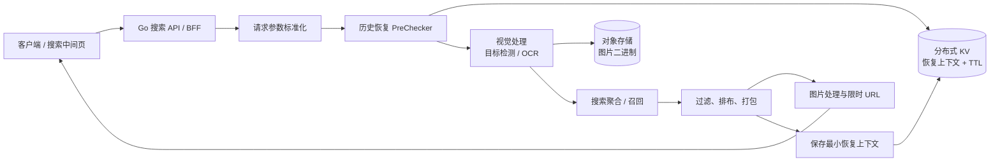
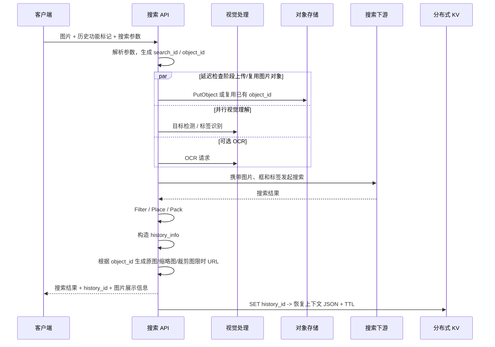
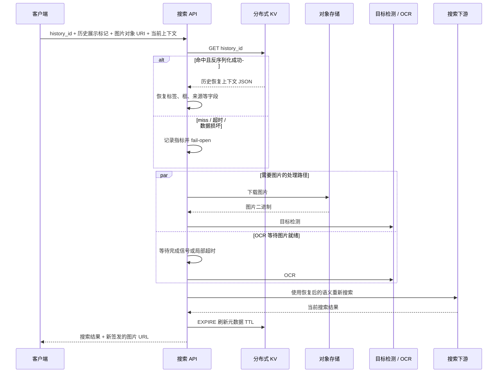
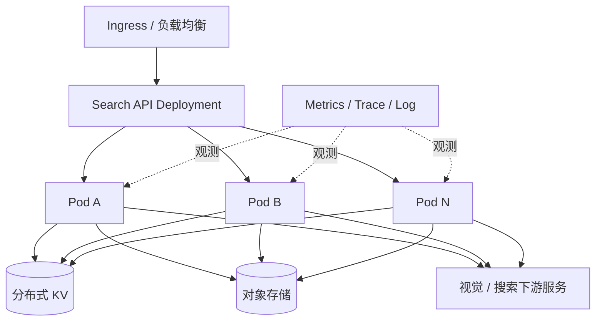

# 视觉搜索历史恢复：面向中兴通讯长沙云计算岗位的项目讲稿

> 文档用途：面试前复习与口述准备。正文已经采用外部可讲的通用术语，避免暴露公司内部服务名、集群名、Bucket 名、配置 Key、流量规模和源码细节。
>
> 真实性原则：文中“当时实现”均来自该需求的代码与提交记录；“建议演进”“云原生化设计”“成熟方案对比”是复盘后的设计思考，不能说成当时已经上线。

## 一、项目介绍：开场先这样说

### 1. 20 秒版本

我参与的是一个大型内容平台的搜索 API 编排服务，服务使用 Go 开发，位于客户端与搜索、视觉理解、对象存储等下游之间，主要负责 HTTP 接入、参数标准化、流程编排、结果组装、灰度降级和可观测性。这个仓库不是搜索算法引擎，而更像搜索场景下的 BFF 和编排中枢。

我负责的子项目是“视觉搜索历史恢复”：让用户在搜索中间页看到之前识别过的图片，并能点击历史记录继续搜索。它不是简单保存一张图片，而是把一次视觉搜索的必要语义状态——原图标识、识别标签、框选区域、入口来源等——进行持久化，之后再恢复这些输入，重新走当前搜索链路。

### 2. 60 秒版本

项目背景是视觉搜索原来只支持单次请求：图片、目标框、识别标签等状态都存在请求内存中，请求结束后就丢失。客户端虽然可以展示一张历史缩略图，但如果只保存图片，再次搜索时无法还原用户当时选中的物体和搜索语义。

我的方案是按数据特性拆分存储：图片二进制放对象存储；恢复搜索所需的少量结构化上下文放分布式 KV，以 `history_id` 做单 Key 点查并设置 TTL；展示图片时根据对象标识生成限时访问 URL。用户点击历史后，服务在串行前置阶段先恢复上下文，再让目标检测、OCR、搜索聚合等阶段继续执行。增强能力出现故障时采用 fail-open，优先保证主搜索链路可用。

这个项目让我完整接触了接口协议、流程编排、KV 与对象存储、并发协调、动态配置、可观测性及失败降级，也能自然延伸到云计算岗位常问的水平扩展、数据一致性、资源治理和容器化部署。

### 3. 一句话记忆点

> 我做的不是“保存一张历史图片”，而是“持久化并恢复一次视觉搜索的输入语义”。

### 4. 项目边界

面试时要主动讲清楚边界：

- 搜索 API 服务拥有 HTTP 参数解析、业务流程编排、下游调用、响应包装、配置消费和稳定性治理。
- 图片识别模型、OCR 模型和搜索召回算法由下游服务提供，本项目负责把它们组织成可用的端到端产品能力。
- 该需求恢复的是搜索输入语义，不是缓存一份永远不变的搜索结果。内容库、模型和排序策略发生变化后，同一历史记录重新搜索，结果允许变化。
- 当时没有新建关系型数据库表，也没有 SQL、JOIN 或跨库事务。
- 该需求覆盖客户端入参协议、服务端编排、存储与响应协议，但不包含前端 UI 代码。讲“全栈偏后端”时可以强调端到端协议协作，不要说自己实现了客户端页面。

### 5. 技术栈速览

| 层次 | 技术/机制 | 面试口径 |
|---|---|---|
| 接入层 | Go + Hertz HTTP 框架 | 仓库既有技术栈，适合高并发网络服务；不是本需求单独选型 |
| 编排层 | 阶段化 Pipeline + 接口化 Worker | 固定主骨架，按场景装配 Checker、Provider、Loader 等策略 |
| 状态层 | 分布式 KV + JSON + TTL | 保存小型恢复上下文，按 history_id 点查 |
| 媒体层 | 对象存储 + 图片处理/签名 URL | 保存图片大对象，按需生成原图、缩略图和裁剪图地址 |
| 并发层 | goroutine、Channel、Context | 并行处理视觉任务，以完成信号和超时控制等待 |
| 治理层 | Feature Flag、动态配置、Metric、Trace、Log | 灰度开关、超时/有效期调整、稳定性观测 |

Go 和 Hertz 是仓库既有选择，不要说成你为这个需求重新选了框架。你真正做的技术决策集中在状态建模、存储分层、流水线接入位置、并发协调和失败语义。

---

## 二、业务问题与目标

### 1. 原始问题

视觉搜索的一次请求通常包含多种状态：

- 用户上传或截取的图片；
- 用户点选、圈选或系统识别出的目标框；
- 视觉模型识别的标签；
- 文字补充条件；
- 搜索来源、二级入口等上下文；
- 下游检索所需的派生参数。

这些状态原本只存在于一次请求中。用户离开页面后，如果客户端仅保存缩略图，那么再次点击时只能知道“这张图”，不知道“当时搜的是图中的哪个对象、采用了什么语义和入口”。

### 2. 功能目标

在不破坏原视觉搜索链路的情况下，形成如下闭环：

1. 首次搜索时保存必要状态；
2. 搜索中间页展示历史图片；
3. 用户点击历史记录时恢复状态；
4. 使用恢复后的语义重新发起搜索；
5. 对历史记录做有效期管理和访问续期；
6. 增强能力失败时不拖垮主搜索。

### 3. 非功能目标

- 低延迟：历史恢复位于搜索前置路径，不能显著增加端到端 P99。
- 高可用：KV、图片下载、URL 签发或 OCR 失败时，主搜索应尽量继续。
- 可扩展：能力通过现有流水线扩展点接入，不把历史逻辑散落到每个下游。
- 可治理：TTL、URL 有效期等参数可动态配置，并有成功率与耗时指标。
- 数据最小化：只保存能重建请求的必要上下文，不保存完整搜索结果快照。

---

## 三、系统上下文与总体架构

### 1. 仓库整体链路

服务的主执行模型可以概括为：

```text
HTTP 接入
  -> 请求参数标准化
  -> Check
  -> Provide
  -> Load
  -> Filter
  -> Place
  -> Pack
  -> Record
  -> HTTP/流式响应
```

各阶段含义：

- `Check`：参数检查、场景识别、状态恢复、安全检查等；
- `Provide`：在召回前准备公共数据或并行计算结果；
- `Load`：调用搜索、业务加载等下游；
- `Filter`：过滤不适合返回的结果；
- `Place`：卡片插入与位置调整；
- `Pack`：组织最终响应结构；
- `Record`：日志、指标和异步记录。

视觉历史能力没有重新设计一套主流程，而是利用已有流水线的扩展点：把“历史状态恢复”实现为一个可条件启用的前置 Checker。

### 2. 功能架构图



### 3. 为什么恢复放在串行 PreChecker

历史状态是后续多个阶段的公共前置条件。若把 KV 读取放在普通并行 Checker 中，目标检测、OCR 或搜索请求可能先读取到未恢复的空字段，形成竞态。因此恢复步骤放在串行前置阶段：

```text
读取 history_id
  -> KV Get
  -> JSON 反序列化
  -> 写入统一 RequestParams
  -> 再启动普通并行 Checker / Provider
```

这个顺序本质上是在流水线中建立一个数据依赖屏障，让后续阶段看到一致的请求上下文。

---

## 四、端到端链路：首次搜索

### 1. 首次搜索时序



上图表达的是业务依赖关系，不是逐行等同源码调度。原流水线中图片上传属于 DelayChecker，会在 Provide 周边与其他处理并行推进；历史 KV 读取才是严格位于普通并行 Checker 之前的串行 PreChecker。

### 2. 详细步骤

#### 步骤 A：请求接入与参数标准化

客户端发送图片、历史功能开关以及视觉搜索参数。HTTP 层只负责接入，参数进入统一的请求上下文，避免后续阶段重复解析原始 HTTP 字段。

关键判断包括：

- 是否开启历史能力；
- 是否是首刷，即 `cursor == 0`；
- 是否已经是一次历史回放；
- 是否需要 OCR、目标框或其他视觉能力。

原协议中的历史展示标记有关闭、小缩略图和大缩略图三种状态；当时两档缩略图约为 72×72 和 198×198。这个细节可以在追问协议设计时说，开场无需背出来。

#### 步骤 B：建立稳定标识

服务为本次搜索建立 `search_id`，并关联图片对象标识。对客户端而言，它最终成为 `history_id`；对服务端而言，它用于定位 KV 中的一份恢复上下文，并间接定位对象存储中的图片。

这里采用高熵、不可预测的请求标识比自增 ID 更适合分布式系统：无需中心发号，也降低被顺序枚举的风险。但高熵 ID 本身不等于权限控制，仍应绑定用户或设备并做所有权校验。

#### 步骤 C：图片进入对象存储

首刷请求携带图片二进制。图片适合放对象存储，而不是放 KV：

- 对象存储适合大对象、高吞吐和生命周期管理；
- KV 适合小对象、按 Key 低延迟读取；
- 图片与元数据分离后，KV Value 更小，网络和内存开销更可控。

#### 步骤 D：视觉理解与搜索

目标检测、标签识别和可选 OCR 产生搜索语义；随后服务把图片对象标识、图片二进制、目标框、标签及其他上下文组织成下游搜索请求。

这一步体现编排服务的价值：模型和搜索引擎是独立下游，但用户看到的是一条完整产品链路。

#### 步骤 E：返回历史展示信息

响应中增加 `history_info`，至少包含：

- `history_id`：客户端下次回放时携带；
- 图片访问 URL：展示原图或缩略图；
- 根据业务场景生成的裁剪图 URL。

当时 KV DTO 没有保存图片对象 ID；客户端的历史条目需要在回放时继续携带可定位图片的对象 URI/标识。服务基于该稳定对象标识重新签发有限期 URL。URL 有效期只控制访问授权，并不代表对象会在 URL 到期时删除。若现在重新设计，我会将对象引用与所有权信息一并纳入服务端历史记录，降低对客户端正确透传的依赖。

#### 步骤 F：保存最小恢复上下文

只在以下条件全部满足时保存：

- 首刷请求；
- 客户端启用历史能力；
- 当前请求不是历史回放。

这样可以避免 load-more 重复写，也避免历史回放不断重建同一份记录。KV 的覆盖式写入使相同 `history_id` 的重复执行具备基本幂等性。

保存放在主搜索和中间结果处理之后还有一个业务原因：需要保存客户端最终实际看到的框，而不是请求刚进入时的原始框。目标检测或中间策略可能调整框选结果，过早保存会导致历史缩略图与回放语义漂移。

### 3. 当时实现的一个关键时序事实

原实现是在主要响应数据完成构造后调用 KV 保存函数。代码注释虽然使用了“异步”表述，但这一调用本身不是 MQ 消息，也不是完整的后台任务系统；面试时应准确说成“位于响应构造后的同步 SDK 调用”。

这带来一个可复盘的竞态窗口：客户端可能先收到 `history_id`，但 KV 写入尚未完成。如果用户立即点击历史，存在短暂的读取 miss。改进方案见后文的一致性设计。

---

## 五、端到端链路：点击历史并恢复搜索

### 1. 历史回放时序



### 2. 详细步骤

#### 步骤 A：识别历史请求

客户端携带非空 `history_id`。服务将其识别为历史回放，而不是普通首刷或 load-more。原协议还要求客户端继续携带图片对象 URI/标识；若希望响应继续返回 `history_info` 并刷新 TTL，还要继续携带历史展示标记。只传 `history_id` 虽然仍能触发 PreChecker，但不一定能完成图片恢复、历史展示和滑动续期。

#### 步骤 B：KV 点查与反序列化

在串行 PreChecker 中执行：

```text
key = namespace + history_id
value = GET(key)
history_context = JSON.Unmarshal(value)
```

恢复的数据被写回统一 `RequestParams`，后续阶段无须感知数据来自客户端还是历史存储。

#### 步骤 C：恢复搜索语义

恢复内容主要包括：

- 搜索来源与二级入口；
- 视觉标签和标签信息；
- 当前框、原始框、客户端展示框；
- 检测索引和原始检测信息；
- 是否要求全框等行为标记。

选择保存这些字段的依据是“是否会影响下一次搜索请求的构造”，而不是“这个字段是否出现在原请求里”。这是最小充分状态原则。

#### 步骤 D：下载图片并协调并行任务

历史请求通常不再携带图片二进制，因此目标检测、OCR 等路径需要从对象存储恢复图片。原实现中存在两个可能获取图片的处理路径，图片就绪后向带缓冲 Channel 发送一次完成信号；OCR 通过 `select` 等待任一路径完成或达到局部超时。

原 MR 的等待预算是固定 50ms，依据当时图片下载高峰 P99 约 20ms 的经验值。当前代码后来把这一预算演进为动态配置，默认值也发生过变化。面试时要说“当时是 50ms，后来演进为配置化”，不要把后来的实现算到原项目里。

#### 步骤 E：重新执行搜索

恢复后重新调用当前目标检测、OCR 和搜索服务。这样做的语义是“恢复当时的搜索意图”，不是“返回当时结果快照”。优点是可以使用最新内容和最新排序；代价是结果不保证与历史时刻完全一致。

#### 步骤 F：滑动续期

历史被再次使用时，对 KV Key 执行 `EXPIRE`，刷新元数据 TTL。它是一种滑动过期策略：活跃记录继续保留，长期不访问记录自动释放。

要注意三个有效期彼此独立：

1. KV 元数据 TTL；
2. 新签发图片 URL 的有效期；
3. 对象存储中图片本体的生命周期。

URL 到期不等于图片删除；KV 到期也不会自动删除图片对象。对象回收需要 Bucket 生命周期或独立清理任务。

---

## 六、数据模型与数据库交互

### 1. 面试官问“涉及几张表”时的标准回答

> 严格来说，这个功能涉及 0 张关系型表，没有 SQL、JOIN 或数据库事务。它使用一个分布式 KV 逻辑命名空间保存恢复上下文，并使用一个对象存储空间保存图片二进制。配置中心保存 TTL、URL 有效期等动态配置，但它不是业务数据表。

### 2. 持久化对象

| 数据类型 | 存储 | 访问方式 | 选择原因 |
|---|---|---|---|
| 视觉搜索恢复上下文 | 分布式 KV | `history_id` 单 Key `SET / GET / EXPIRE` | Value 小、点查、低延迟、天然 TTL |
| 原始图片 | 对象存储 | `object_id` 上传/下载 | 适合大对象、成本低、可配生命周期 |
| 原图/缩略图/裁剪图访问地址 | 图片处理与签名服务 | 根据对象 ID 和模板临时生成 | 避免长期暴露存储地址，可控制有效期 |
| TTL、URL 有效期、超时 | 动态配置中心 | 强类型 Getter | 可灰度、可快速调整、无需重新发布 |

### 3. 逻辑数据模型

可以把 KV Value 抽象成下面的 DTO：

```go
type VisionHistoryContext struct {
    SchemaVersion      int
    SearchSource       string
    SecondaryEntry     string
    VisionTag          *VisionTag
    TagInfo            string
    CurrentBox         *BoundingBox
    OriginalBox        *BoundingBox
    ClientDisplayBox   *BoundingBox
    DetectionIndex     string
    DetectionRaw       string
    RequireFullBox     bool
    CreatedAt          int64
}
```

其中 Channel、Context、图片二进制等请求内对象不应序列化。原实现已通过 JSON 忽略标记排除 Channel；`SchemaVersion`、`CreatedAt` 是推荐演进字段，并非原版已具备。

另一个重要边界是：原版 DTO 也没有序列化 `object_id`。历史回放中的图片引用由客户端/历史列表继续透传；把 `object_id`、Owner 和 SchemaVersion 一起纳入服务端记录，是更完整的后续设计。

### 4. 实际交互动作

```text
首次搜索：SET history:{history_id} <json> <ttl>
历史回放：GET history:{history_id}
成功展示：EXPIRE history:{history_id} <ttl>
图片首刷：PUT object/{object_id}
历史恢复：GET object/{object_id}  // 原版 object_id 由客户端继续透传
图片展示：SIGN object/{object_id} + transform_template + expiry
```

### 5. 为什么不用 MySQL

当前访问模型是：已知 `history_id`，读取一条小型状态；没有条件筛选、关联查询、复杂更新和多记录事务。KV 更符合访问模式：

- 单 Key 查询路径短；
- TTL 是一等能力；
- 水平扩展更直接；
- 不需要关系模型与二级索引。

但如果需求升级为“服务端按用户分页展示全部历史、按时间排序、批量删除、容量统计”，仅有 `history_id -> context` 就不够。届时可增加：

```text
uid -> 按时间排序的 history_id 索引
history_id -> history_context
```

索引可以使用有序集合、宽表或关系数据库，具体取决于分页、事务、查询和成本要求。这是未来选型，不是当前实现。

### 6. 为什么不把图片放 KV

- 图片体积远大于 JSON 元数据，会放大 KV 内存成本；
- 大 Value 会增加网络传输、序列化和尾延迟；
- 对象存储具备更适合图片的吞吐、容量和生命周期能力；
- 图片可以通过缩略图和裁剪模板按需派生，KV 只需保存稳定对象 ID。

### 7. 为什么不保存完整搜索结果

- 搜索结果体积大，写放大明显；
- 内容可能下架，旧快照可能不再适合展示；
- 排序、模型和策略会演进；
- 本需求真正需要的是“恢复用户意图并继续搜索”。

因此选择保存最小输入状态，是容量、正确性与产品语义之间的平衡。

---

## 七、关键技术选型与权衡

### 1. 选型总表

| 决策 | 当时选择 | 收益 | 代价 / 风险 |
|---|---|---|---|
| 元数据存储 | 分布式 KV + TTL | 点查快、模型简单、自动过期 | 不支持用户维度复杂查询 |
| 图片存储 | 对象存储 | 适合大对象、成本和容量可扩展 | 与 KV 存在跨存储一致性问题 |
| 图片访问 | 限时签名 URL | 限制直接访问时间、支持裁剪/缩略 | URL TTL 不等于对象生命周期 |
| 保存内容 | 最小恢复上下文 | Value 小、可使用最新检索结果 | 无法保证历史结果完全复现 |
| 流程接入 | 串行 PreChecker | 确保下游先看到恢复状态 | KV 延迟进入关键路径 |
| OCR 协调 | Channel + 局部超时 | 轻量、避免无限等待 | 原版可能重复下载，超时后底层未必取消 |
| 故障策略 | Fail-open | 增强功能故障不影响主搜索可用性 | 用户可能看不到历史或语义降级 |
| 配置 | 动态配置 | TTL/超时可快速调整 | 必须校验零值、范围和回退默认值 |

### 2. Fail-open 的适用性

历史能力是增强能力，不应成为整个搜索的单点故障。原实现对 KV miss、读取失败、JSON 损坏、续期失败、图片 URL 生成失败等情况主要采用记录日志/指标后继续主流程。

这不是“熔断器”设计模式，因为没有失败阈值、打开/半开/关闭状态机；准确说法是“失败开放和优雅降级策略”。

如果涉及权限校验失败，则不能 fail-open 到读取他人数据。安全失败必须 fail-closed，即拒绝访问该历史对象。

### 3. 动态配置与 Feature Flag 分工

- Feature Flag / AB：是否启用历史能力、是否启用新恢复逻辑、灰度人群；
- 动态配置：元数据 TTL、图片 URL 有效期、阶段超时、重试次数；
- 代码默认值：配置中心不可用时的安全回退。

配置读取应集中封装，明确类型、默认值和合法范围，避免业务代码散落魔法字符串。

### 4. 为什么不是 Cache-Aside

KV 在这里不是一个“查不到就回源数据库”的缓存，而是历史恢复上下文的主存储。没有另一个权威关系库作为回源，因此不应把它描述为 Cache-Aside。

### 5. 为什么不是分布式事务

图片对象和 KV 元数据是分步写入，原实现没有两阶段提交、Saga、Outbox 或补偿状态机。这个选择降低了关键路径复杂度，但接受了短暂不一致，依靠 fail-open 和生命周期治理降低影响。

---

## 八、并发、超时与性能设计

### 1. 原实现的并发协调

历史请求的图片可能被多个后续阶段需要。原实现使用带缓冲 Channel 作为一次性完成信号：图片下载路径成功后通知，OCR 等待任一路径完成；若超过局部预算则跳过 OCR。

准确表述：

- 这是 producer-consumer 式的一次性完成通知；
- 不是经典 Observer，因为没有订阅者列表和事件广播；
- 超时只代表调用方不再等待，不代表底层下载一定被取消；
- Channel 应防止重复关闭、重复发送和 goroutine 泄漏。

### 2. 局部超时与总请求 Deadline

建议的预算关系：

```text
总请求 Deadline
  >= KV 恢复预算
   + 图片下载预算
   + 视觉处理预算
   + 搜索下游预算
   + 打包与网络余量
```

每个阶段都应读取请求剩余时间，阶段超时不能超过总 Deadline。所有下游 Client 应接收并遵守 Go `Context`，这样用户取消或总请求超时时，RPC、存储请求和 goroutine 才能尽快停止。

### 3. 可演进为 singleflight 去重下载

若同一个 `object_id` 被目标检测和 OCR 同时请求，两个路径各自下载会造成重复 I/O，也可能并发写同一个图片字段。可用 Go 官方扩展库中的 `singleflight` 做重复调用抑制：

```text
目标检测需要图片 ─┐
                  ├─ singleflight(object_id) -> 一次对象下载
OCR 需要图片     ─┘
```

但要说明：singleflight 不是缓存、限流器或熔断器；它只合并同一时刻相同 Key 的重复调用。该能力是后续优化建议，原 MR 未使用。

### 4. 延迟预算示例

下面只是设计示例，不能当作真实线上数据：

| 阶段 | 示例预算 | 超时后的策略 |
|---|---:|---|
| KV Get + 反序列化 | 10ms | 不恢复历史，继续主搜索 |
| 对象下载 | 40ms | 跳过依赖图片的增强能力 |
| OCR | 80ms | 无 OCR 条件继续检索 |
| 搜索下游 | 200ms | 使用已有降级或空结果策略 |
| 打包与网络余量 | 30ms | 尽快完成响应 |

真正预算应根据线上 P50/P95/P99、整体 SLA 和依赖方超时共同制定。

### 5. 容量估算方法

不要背一个没有证据的线上数字，面试时写公式更专业。

```text
KV 写 QPS = 搜索 QPS × 历史启用率 × 首刷占比
KV 读 QPS = 历史点击 QPS
KV 原始容量 = 每日新增历史数 × 单条 JSON 大小 × 保留天数
KV 实际容量 ≈ 原始容量 × 副本系数 × 编码/索引开销

对象存储总容量 = 每日唯一图片数 × 平均图片大小 × 对象保留天数
对象下载带宽 = 历史恢复 QPS × 平均图片大小
```

该需求复用了视觉搜索原链路已经上传的图片对象，并不是为每一条历史记录再复制一份图片。因此评估“本功能带来的对象存储增量”时，更准确的公式是：

```text
对象存储增量
≈ 每日唯一图片数 × 平均图片大小
  × max(0, 历史要求保留期 - 原链路对象保留期)
```

纯假设示例：如果 KV 写入为 10 次/秒、单条 2KiB、保留 30 天，则原始数据约 49.4GiB；若三副本且暂不计编码开销，约 148GiB。这个数字仅演示估算方法，不代表项目真实流量。

---

## 九、一致性、幂等性与故障处理

### 1. 一致性模型

该功能横跨对象存储与 KV，没有跨存储事务，属于最终一致性增强能力。接受这一模型的原因是：

- 历史功能失败不会造成资金或核心数据错误；
- 强行引入分布式事务会显著增加复杂度与延迟；
- 主搜索可通过 fail-open 保持可用；
- 孤儿对象可通过生命周期和离线治理回收。

### 2. 故障矩阵

| 故障点 | 原实现语义 | 用户影响 | 建议演进 |
|---|---|---|---|
| 对象上传成功、KV 写失败 | 记录错误，主搜索继续 | 有图片孤儿，历史无法恢复 | Bucket 生命周期 + 孤儿扫描 |
| 对象上传失败、KV 写成功 | 可能存在元数据但图片不可用 | 历史展示/恢复降级 | 写入前校验对象状态，记录可用状态 |
| 客户端先收到 ID、KV 尚未写完 | 立即点击可能 miss | 短暂无法恢复 | 写成功后再返回，或状态化/短重试 |
| KV Get miss / 超时 | Fail-open | 按普通请求继续或缺失历史语义 | 区分 miss、timeout、corrupt 指标 |
| JSON 损坏 / Schema 不兼容 | Fail-open | 无法恢复 | SchemaVersion + 兼容解码 |
| URL 签发失败 | 返回空 URL 或降级 | 缩略图不显示 | 短重试 + 默认占位图 |
| OCR 等待超时 | 跳过 OCR | 搜索语义可能变弱 | 动态超时、取消传播、下载去重 |
| EXPIRE 失败 | 主搜索继续 | 历史可能按旧 TTL 到期 | 异步补偿或低频重试 |

### 3. 幂等性

- 相同 `history_id` 的 KV `SET` 是覆盖式写，天然具有基本幂等性；
- 只在首刷保存，避免 load-more 和历史回放产生重复写；
- 对象上传若以稳定 `object_id` 定位，可降低重复对象数量，但必须确认对象存储覆盖语义；
- 重试必须区分可重试错误与业务错误，避免无限重试放大下游压力。

### 4. 更稳妥的写入演进方案

可以引入轻量状态，而不是直接上分布式事务：

```text
INIT -> IMAGE_READY -> META_READY -> AVAILABLE
                     \-> FAILED
```

一种可选时序：

1. 上传图片并拿到成功结果；
2. 写入 KV 元数据和 `AVAILABLE` 状态；
3. 只有 KV 写成功后才把可点击的 `history_id` 返回客户端；
4. 失败记录进入低成本清理或补偿任务。

若响应延迟不允许等待 KV，可继续异步化，但应增加“未就绪”状态、客户端短重试或服务端读后短暂重试，并通过队列/Outbox 保证事件可靠性。是否值得引入 Outbox，取决于历史数据的重要级别；对当前非核心增强功能，很可能生命周期兜底比复杂事务更划算。

### 5. TTL 的边界

滑动 TTL 会让频繁访问的记录长期存在。如果隐私或合规要求存在绝对最长保留期，建议同时保存 `created_at`，续期时使用：

```text
new_expire_at = min(now + sliding_ttl, created_at + absolute_max_ttl)
```

这属于推荐改进，原版 Value 没有完整的绝对保留上限状态。

---

## 十、可观测性设计

### 1. 当时已有的观测思路

原实现对以下动作增加了成功、失败或耗时指标：

- 历史保存成功/失败；
- JSON 序列化失败；
- 历史读取与反序列化失败；
- 历史恢复耗时；
- URL 生成耗时；
- TTL 续期失败；
- OCR 等视觉处理的错误与超时日志。

### 2. 推荐的 RED 指标

```text
Rate：历史保存 QPS、恢复 QPS、图片下载 QPS
Errors：按 stage/reason 拆分失败率和降级率
Duration：KV、对象下载、OCR、搜索下游、端到端 P50/P95/P99
```

建议指标：

```text
vision_history_restore_requests_total
vision_history_restore_failures_total{stage,reason}
vision_history_restore_duration_ms
vision_history_kv_operation_duration_ms{operation,result}
vision_history_image_download_duration_ms{result}
vision_history_ocr_timeout_total
vision_history_fallback_total{reason}
```

### 3. Trace 拆分

```text
vision_history.restore
├── kv_get
├── deserialize
├── object_download
├── object_detection
├── ocr
├── search_aggregation
├── pack_response
└── renew_ttl
```

### 4. 指标基数治理

可作为标签的低基数字段：

- `operation=get|set|expire`；
- `result=success|miss|error`；
- `stage=kv|object|ocr|search`；
- `reason=timeout|not_found|deserialize_error|download_error`。

绝不能把 UID、history_id、object_id、完整 query、完整错误文本或图片 URL 放进 Metric Label，否则时序数量接近请求量，会引发高基数爆炸。排障 ID 可脱敏后放进采样日志或 Trace。

### 5. 告警建议

- 历史恢复成功率低于 SLO；
- KV P99 或对象下载 P99 突增；
- OCR 超时率突增；
- fail-open 降级率异常；
- 对象存储增长速度与元数据增长速度严重背离；
- 配置读取失败或使用默认值比例异常。

---

## 十一、安全、隐私与数据生命周期

### 1. 所有权校验

原实现以 `history_id` 直接定位记录，Key 没有显式绑定 UID/设备，读取时也缺少明确的所有权校验。这是面试中应主动指出的改进点。

建议方案：

- KV Value 保存 `owner_id_hash` 或将所有者纳入 Key；
- 读取时校验当前登录用户/设备与记录归属；
- 未登录场景使用设备身份与服务端签发的不可伪造 token；
- `history_id` 保持高熵，防枚举，但不能只依赖“猜不到”。

安全失败必须 fail-closed：校验失败时不能返回图片或历史语义。

### 2. 签名 URL

- URL 应短期有效，按需重新签发；
- 签发身份只拥有必要对象与操作权限；
- 日志和 Trace 不记录完整签名参数；
- 不把临时 URL 当作长期业务数据；
- 原图、缩略图和裁剪图可使用不同模板与权限策略。

### 3. 凭证管理

历史实现中曾存在把凭证兜底写在代码侧的工程风险。复盘时应明确：生产凭证应由密钥管理服务或运行时注入，代码只引用配置，不存明文，不进入日志、Git 历史和异常信息，并具备轮换和最小权限。

### 4. 生命周期与删除

需要分别治理：

- KV 元数据到期；
- 图片 URL 授权到期；
- 对象本体过期删除；
- 用户主动删除；
- 账号注销或合规删除；
- 孤儿对象扫描与回收。

原版代码只明确了 KV TTL 和 URL 有效期，未在业务代码中看到对象删除，因此不能声称“图片已自动删除”。更成熟的实现应由对象存储生命周期作为保底，并提供主动删除与审计能力。

---

## 十二、设计模式：怎么讲才准确

### 1. Template Method / 模板化流水线

仓库已有固定阶段骨架：`check -> provide -> load -> filter -> place -> pack -> record`。不同搜索场景在各阶段注册不同 Worker。

可讲：

> 我基于仓库已有的模板化 Pipeline 扩展能力。主流程保持不变，只把历史恢复放入合适阶段，因此降低了对其他搜索场景的侵入。

不要讲：

> 我从零设计了整套 Template Method 框架。

### 2. Strategy + 插件化 Worker

每个阶段通过接口定义行为，配置项包含 Worker 构造函数、Enable 条件和 Options。历史恢复实现为一个 Checker，只在存在 `history_id` 时装配。

可讲：

> 不同 Checker 可以看作可替换策略，按搜索场景和请求条件插件化注册。我的能力通过接口和 Enable Predicate 接入，没有在主流程里堆大量 if/else。

不宜硬说抽象工厂：这里主要是函数式构造和注册表，没有完整产品族工厂层。

### 3. Context Object / DTO

统一 `RequestParams` 是跨阶段上下文对象；`VisionHistoryContext` 是持久化 DTO。状态恢复后，下游继续读取统一上下文，不需要知道数据来自 KV。

### 4. Client / Facade 式基础设施隔离

业务层通过 KV Client、对象存储 Client、图片 URL Client 和配置 Getter 使用基础设施，避免把 SDK 初始化和鉴权细节散落到业务流程中。可以说“client/facade 式分层”，不必强行命名为经典 GoF Adapter。

### 5. 类职责链思想

Checker Manager 会按顺序执行前置 Checker，再并发执行普通 Checker。它有职责链思想，但 Worker 自身没有 `next` 指针，由 Manager 统一迭代，所以不是教科书式 Chain of Responsibility。面试主讲 Template Method 和 Strategy 即可。

### 6. 明确没有使用的模式

- 没有 Repository/DAO 抽象：当时业务代码仍直接调用共享 Client；
- 没有 Cache-Aside：KV 是主存储，不是缓存；
- 没有 Circuit Breaker：只有 fail-open，没有熔断状态机；
- 没有 Observer：Channel 是一次性完成通知；
- 没有 Saga、Outbox、CQRS、事件溯源、MQ 异步持久化或分布式事务。

这样回答反而更可信：设计模式服务于问题，不需要为了面试强行套名词。

---

## 十三、成熟项目与官方方案对比

本节用于说明选型符合成熟系统的一般原则。它们是外部印证与演进参考，不是本项目实际依赖。

### 1. Nextcloud：文件内容与元数据分离

[Nextcloud 对象存储官方文档](https://docs.nextcloud.com/server/stable/admin_manual/configuration_files/primary_storage.html)说明，对象存储保存文件内容，文件名、目录等元数据由数据库管理，恢复时需要同时考虑两类数据。

对本项目的启发：

- 原图等大对象放对象存储；
- 框选、标签、来源和对象 ID 等小状态放 KV；
- 成熟设计中由元数据保存稳定对象 ID，不保存临时 URL；原版项目尚依赖客户端继续透传对象 URI；
- 两类存储的删除、备份和恢复需协同。

差异是本项目只按 `history_id` 点查，没有 Nextcloud 的目录、列表和复杂文件索引，因此用 KV 而不是完整关系数据库更合适。

### 2. Immich：媒体服务与后台任务

[Immich 官方架构](https://docs.immich.app/developer/architecture/)将持久化元数据、原始媒体文件以及缩略图/元数据提取/智能搜索等后台任务分开处理；[其备份文档](https://docs.immich.app/administration/backup-and-restore/)也强调元数据与媒体文件的一致性。

对本项目的启发：耗时或可重建的派生任务可以异步化，原始对象与元数据应分别治理。不能因此声称当前项目已经使用任务队列或拥有完整备份恢复系统。

### 3. Redis：TTL 与滑动续期

[Redis `SET` 官方文档](https://redis.io/docs/latest/commands/set/)展示了写值时设置过期时间的原子语义；[`EXPIRE` 官方文档](https://redis.io/docs/latest/commands/expire/)说明可以更新已有 Key 的 TTL。

本项目使用的是内部的 Redis-compatible KV，不应直接说成 Redis，但访问模型相似：首次 `SET + TTL`，历史访问后 `EXPIRE` 续期。成熟实现还应考虑绝对最长保留时间和不必要的频繁续期。

### 4. S3：预签名 URL 与对象生命周期分离

[Amazon S3 预签名 URL 文档](https://docs.aws.amazon.com/AmazonS3/latest/userguide/using-presigned-url.html)说明预签名 URL 提供有限期访问；[S3 Lifecycle 文档](https://docs.aws.amazon.com/AmazonS3/latest/userguide/object-lifecycle-mgmt.html)则单独负责对象转换和过期。

可借鉴的原则是：URL 到期、元数据到期、对象删除是三个不同机制。内部对象存储和图片处理服务不等同于 AWS S3，但这一设计边界是一致的。

### 5. Go：singleflight 与 Context

[Go `singleflight` 官方包文档](https://pkg.go.dev/golang.org/x/sync/singleflight)将其定义为相同 Key 的重复调用抑制；[Go Context 官方文章](https://go.dev/blog/context)强调把 deadline 和取消信号沿调用链传播。

对应的演进方向：用 `singleflight(object_id)` 合并并发图片下载，用 `Context` 让对象存储、视觉 RPC 和搜索 RPC 在请求取消时停止工作。

### 6. OpenTelemetry 与 Prometheus：链路与指标

[OpenTelemetry Signals](https://opentelemetry.io/docs/concepts/signals/)覆盖 Trace、Metric 和 Log；[Prometheus 埋点实践](https://prometheus.io/docs/practices/instrumentation/)建议在线服务重点关注请求量、错误和延迟，并避免高基数标签。

本项目当时使用内部日志、指标和 Trace，不能说已接入 OpenTelemetry；但按 KV、对象下载、OCR、搜索、续期拆 Span 和 RED 指标，是可以迁移到任何云平台的可观测设计。

### 7. OpenFeature：功能开关与动态配置

[OpenFeature 官方介绍](https://openfeature.dev/docs/reference/intro/)提供厂商无关的 Feature Flag 抽象。对本项目的借鉴是把功能准入与数值参数分开：Flag 管灰度和快速关闭，配置中心管 TTL、超时和 URL 有效期。

内部配置系统不是 OpenFeature，不能声称已使用该项目。

---

## 十四、面向中兴通讯长沙云计算岗位的云原生化表达

### 1. 为什么这个项目与云计算岗位相关

我没有拿到该岗位的完整 JD，以下定制基于“中兴通讯长沙云计算岗位”这一职位方向，以及中兴官方公开的长沙研发与云基础设施技术重点。

它不是传统云平台控制面项目，但包含云计算岗位很看重的通用问题：

- 无状态服务与外部状态存储；
- KV 和对象存储选型；
- 多下游微服务编排；
- 超时、降级和依赖故障隔离；
- 配置中心与渐进发布；
- Trace、Metric、Log 可观测性；
- 容量规划、数据生命周期和成本治理；
- 容器水平扩展与多可用区部署。

中兴长沙研发基地的官方介绍覆盖云计算、大数据、AI 和分布式存储方向；中兴云基础设施产品也强调 Kubernetes、微服务、高可靠、低时延和开放兼容。因此面试表达应从“一个业务功能”上升到“一个可水平扩展、有状态外置、可观测和可降级的云原生服务单元”。

参考：[中兴长沙研发基地](https://www.zte.com.cn/china/headlines/exhibition_hall/exhibition_internal_cs.html)、[ZTE TECS OpenPalette](https://www.zte.com.cn/china/product_index/cloud_core_network/cloud-infrastructure/tecs2/tecs-cloudfoundation.html)。

### 2. 如果部署在 Kubernetes 上

这部分是工程推演，不是原 MR 的上线事实。



#### 无状态与水平扩展

API Pod 不在本地保存会话和历史状态，状态都在外部 KV、对象存储及下游服务中，因此可用 Deployment 横向扩容。`history_id` 使任意 Pod 都能恢复请求，无须 Sticky Session。

#### Probe 设计

根据 [Kubernetes Probe 官方文档](https://kubernetes.io/docs/concepts/workloads/pods/pod-lifecycle/#container-probes)：

- `startupProbe`：保护启动较慢的进程，启动完成前不执行其他探针；
- `readinessProbe`：判断是否接收流量，失败时从 Service Endpoint 移除；
- `livenessProbe`：只判断进程是否需要重启，不能把短暂下游抖动直接等价为进程死亡。

不要在 liveness 中强依赖所有下游，否则 KV 短暂故障可能导致全部 Pod 被循环重启，形成级联故障。

#### HPA 设计

根据 [Kubernetes HPA 官方文档](https://kubernetes.io/docs/tasks/run-application/horizontal-pod-autoscale/)，可综合使用：

- CPU、内存；
- 请求 QPS / 并发数；
- P95/P99 延迟；
- 图片下载或 OCR 等待队列长度；
- goroutine 数或连接池使用率。

仅按 CPU 扩容可能看不出 I/O 阻塞；对于编排服务，QPS、在途请求和尾延迟通常更有代表性。

#### 多可用区和容灾

- API Pod 跨可用区分布，避免单节点/单机房故障；
- KV 和对象存储使用多副本或纠删码能力；
- 配置中心和服务发现具备本地缓存与默认值；
- 下游超时、隔离、限流、重试预算和降级策略明确；
- 跨地域容灾要考虑数据复制延迟、对象可见性与 RPO/RTO。

### 3. 云计算岗位可深挖的四个关键词

#### 高可靠

用 fail-open 隔离增强功能故障；对安全校验 fail-closed；通过多副本、超时、降级、探针和告警控制故障半径。

#### 低时延

KV 单 Key 点查、图片与元数据分离、并行视觉任务、局部超时、请求取消、下载去重，并用 P99 而非平均值制定预算。

#### 弹性

服务无状态化后可以横向扩容；HPA 使用 CPU 与业务指标；外部 KV、对象存储和下游连接池也要同步评估容量，不能只扩 Pod。

#### 可观测

用统一 trace_id 串联 HTTP、KV、对象存储、OCR 和搜索下游；通过 RED 指标、低基数标签和分阶段告警定位瓶颈。

---

## 十五、项目复盘：当时实现与建议演进

| 主题 | 当时实现 | 现在复盘会怎么改 |
|---|---|---|
| 状态存储 | 单 Key JSON + TTL | 加 SchemaVersion、CreatedAt、Owner 校验 |
| 图片存储 | 对象存储 + 限时 URL | 补 Bucket 生命周期、主动删除、孤儿清理 |
| 写入一致性 | 对象与 KV 分步写 | 调整返回时序或增加就绪状态/补偿 |
| 读取一致性 | 串行 PreChecker 恢复 | 保留该设计，增加短重试与明确错误分类 |
| 并发协调 | Channel + 固定局部超时 | 配置化预算、Context 取消、singleflight 去重；后续代码已用 `close + sync.Once` 改善重复通知，但不属于原 MR |
| 降级 | 大部分错误 fail-open | 安全校验 fail-closed，业务增强继续 fail-open |
| 配置 | TTL/URL 有效期可配置 | 加范围校验、版本审计、默认值监控 |
| 可观测性 | 自定义成功率、失败与耗时指标 | 完整 RED + 分阶段 Trace + SLO |
| 测试 | MR 未新增单测 | 表驱动测试、并发/race、存储集成与故障注入 |

### 1. 测试债务怎么诚实回答

> 这次 MR 当时没有补齐新增单测，这是我复盘后认为最明显的工程债务。若现在重做，我会先把 KV 和对象存储抽成接口，再补下面几类测试，而不是用线上效果来回避测试不足。

建议测试集：

- KV 命中、miss、timeout、损坏 JSON；
- 新旧 Schema 兼容和缺省字段；
- 首刷、load-more、历史回放的写入条件；
- `SET / GET / EXPIRE` 成功与失败；
- JPEG、PNG、WebP、旋转图、零尺寸图；
- bbox 越界、负值、反向坐标、空框；
- Channel 任一路径完成、双路径同时完成、超时、Context 取消；
- `go test -race` 检查共享图片字段；
- 对象成功/KV 失败和 KV 成功/对象失败的故障注入；
- 所有权校验和不可枚举性测试。

### 2. 原实现中可主动指出的工程问题

- JSON 序列化失败后不应继续以空字符串写 KV；
- TTL 配置必须校验零值、负值和上下限；
- 图片裁剪应支持更多格式并校验边界；
- 签名凭证不得在代码中兜底；
- 两个路径并发下载和写图片字段需要去重/同步；
- 指标耗时单位应统一；
- `history_id` 必须绑定所有者；
- URL TTL、KV TTL 和对象生命周期要分别治理。

另一个实现边界是：原 MR 的持久化调用挂在视觉搜索流式入口，单次非流式入口虽然能组装部分历史展示信息，却没有同等的保存调用。若产品实际只从流式入口使用，该边界不会影响主场景；若要统一多入口能力，应把保存动作下沉到公共阶段并补齐一致性测试。

主动复盘不会减分，前提是先讲清楚当时为什么做、产生了什么闭环，再说明如何演进。

---

## 十六、面试口述稿

### 1. 90 秒 STAR 版本

**S，背景：** 视觉搜索中间页需要展示并支持再次点击历史记录，但原链路的图片、目标框和视觉标签只存在单次请求内。只存一张缩略图，二次搜索无法恢复用户当时选中的对象和语义。

**T，任务：** 我需要在不破坏普通视觉搜索主链路的前提下，完成“首搜保存—中间页展示—点击恢复—重新检索”的闭环，同时控制延迟、有效期和故障影响。

**A，行动：** 我先把数据按特性拆开：图片放对象存储，少量恢复上下文放分布式 KV，以 history_id 单 Key 查询并设置 TTL；图片展示时动态生成限时的原图、缩略图和裁剪图 URL。流程上，我把历史恢复实现成一个可条件启用的 PreChecker，在并发视觉处理前先恢复标签和框，后续目标检测、OCR 和搜索下游继续消费统一请求上下文。图片下载与 OCR 用 Channel 加局部超时协调，KV 或图片增强能力失败时 fail-open，保证主搜索可用，并增加保存、恢复、续期和耗时指标。

**R，结果：** 代码层面形成了可回放的视觉搜索历史闭环，支持从中间页续搜，同时将状态和图片访问都做了时效治理。真实业务提升只会讲我能拿出实验或监控证据的数据，不会编造百分比。复盘上，我会补所有权校验、对象生命周期、下载去重和系统化测试。

### 2. 3 分钟技术版

1. 先解释项目是搜索 API/BFF 编排服务，而不是算法引擎；
2. 说明难点不是展示历史图，而是恢复一次搜索的语义；
3. 展开 KV 元数据 + 对象存储的分层；
4. 展开首刷保存和历史恢复两条链路；
5. 解释串行 PreChecker、Channel 超时和 fail-open；
6. 说明 0 张关系表、无跨库事务及最终一致性取舍；
7. 主动复盘安全、生命周期、并发与测试债务；
8. 上升到云原生：无状态 Pod、水平扩展、HPA、可观测与多可用区。

### 3. 最后收束

> 这个需求的业务入口很小，但背后覆盖了状态建模、分布式存储、并发协调和稳定性。它让我理解到，BFF 不只是转发接口，而是要把多个有不同延迟和失败语义的下游组织成一个可用、可扩展、可观测的产品链路。

---

## 十七、高频追问与参考回答

### Q1：涉及哪几张表？

没有关系型表。一个 KV 逻辑命名空间保存 `history_id -> JSON 上下文`，一个对象存储空间保存图片；动态配置不是业务表。KV 动作是 `SET + TTL / GET / EXPIRE`，无 SQL、JOIN 和事务。

### Q2：为什么选 KV，不选 MySQL？

访问模型是已知 history_id 的单条点查，Value 小且天然需要 TTL，没有复杂查询。KV 路径更短、扩展更直接。如果以后做用户历史列表、排序和批量删除，我会增加用户维度索引，届时再评估有序集合、宽表或关系库。

### Q3：图片为什么不直接存数据库？

图片是大对象，放 KV/关系库会放大存储、网络和内存成本；对象存储更适合容量、吞吐和生命周期。元数据保存稳定对象 ID，展示时再签发 URL。

### Q4：如何保证 KV 和对象存储一致？

原实现没有强一致事务，而是接受最终一致性，因为这是非核心增强功能。对象成功/KV 失败会产生孤儿图片，反向失败会产生不可用历史。当前用 fail-open 保主搜索；演进上用写入状态、返回时序调整、Bucket 生命周期、孤儿扫描和必要的补偿任务治理。

### Q5：为什么恢复放在 PreChecker？

标签、框和来源是多个并行阶段的输入。串行恢复先建立一致上下文，再启动目标检测、OCR 和召回，可避免下游读到未恢复状态。若普通 Checker 并发读写同一上下文，会存在竞态。

### Q6：Channel 在这里解决什么问题？

它是图片下载完成的一次性通知，让 OCR 不必盲等或轮询；同时用局部 timeout 保证增强能力不突破总延迟预算。它不是 Observer，也不等于取消底层下载。更成熟的实现会加 Context 取消和 singleflight 下载去重。

### Q7：为什么采用 fail-open？

历史是增强能力，不能因为 KV 抖动导致所有搜索失败，所以业务读取失败时降级。但权限校验不能 fail-open，安全边界必须 fail-closed。

### Q8：有没有设计模式？

主流程复用了模板化 Pipeline；各阶段 Worker 是接口化、配置驱动的 Strategy/插件模式；历史上下文是 DTO/Context Object；基础设施通过 Client 分层隔离。我不会把 Channel 硬说成 Observer，也不会声称使用了当时没有的 Repository、Saga 或熔断器。

### Q9：怎么做水平扩展？

API 实例不保存会话状态，历史都在外部 KV 和对象存储，任意实例可根据 history_id 恢复，所以可作为无状态 Deployment 横向扩容。HPA 除 CPU 外还应看 QPS、在途请求和 P99；同时评估 KV、对象下载带宽和下游连接池容量。

### Q10：如果 KV 故障怎么办？

设置短超时，记录错误和降级指标，历史语义不恢复但主搜索继续；如果故障率持续升高，可通过 Feature Flag 关闭历史读写，保护 KV 与主链路。配置中心不可用时使用已验证默认值。

### Q11：怎么做监控？

按 Rate、Errors、Duration 建 RED 指标；Trace 拆为 KV、下载、OCR、搜索和续期阶段；指标标签保持低基数，history_id 和 UID 只进入脱敏采样日志或 Trace，不做 Label。

### Q12：怎么做数据安全？

history_id 需要绑定 UID/设备并做所有权校验；对象 URL 短期签发、最小权限、日志脱敏；凭证由 Secret 管理；KV TTL、URL TTL 和对象生命周期分别治理；支持主动删除和合规清理。

### Q13：为什么不缓存搜索结果？

需求是复现搜索意图，不是冻结旧结果。重新检索能反映最新内容和策略，也避免大结果快照的存储成本；代价是结果可能变化，这符合产品语义。

### Q14：项目最大的不足是什么？

当时没有新增单测是最明确的不足；此外所有权校验、跨存储生命周期、重复下载和固定超时仍有演进空间。我现在会通过 Store 接口、表驱动测试、race 检测和故障注入补齐。

### Q15：如果流量扩大 10 倍，先看哪里？

先用公式拆 KV QPS/容量、对象存储容量和下载带宽，再看端到端 P99、连接池、goroutine、GC 和下游限额。API Pod 横向扩容只解决计算层，KV 分片、热点 Key、对象出口带宽和下游配额也必须同步扩容或限流。

### Q16：热点 Key 会出现吗？

正常 history_id 高度离散，单条历史点击量有限，天然热点风险比用户级聚合 Key 小。如果某记录被异常分享或攻击，仍应在鉴权、频控和服务端限流层处理，并监控单 Key 访问异常。

### Q17：如何做灰度上线？

先内部环境验证，再按稳定 UID/设备做一致性分桶，逐步从小流量扩大；每阶段观察恢复成功率、P99、OCR 超时、对象下载失败和降级率；保留快速关闭开关。只有拿到真实配置和实验记录时，才说具体灰度比例。

### Q18：为什么适合云计算岗位？

我不把它包装成云平台本身，而是强调其中可迁移的云工程能力：无状态服务、分布式 KV、对象存储、微服务依赖、容器扩缩、可观测、数据生命周期和故障隔离。这些能力与云基础设施上的业务服务设计直接相关。

---

## 十八、不要说错的地方

- 不要说用了 MySQL/Redis 表；准确说“分布式 KV，访问模型类似 Redis KV + TTL”。
- 不要把 KV Key 前缀叫成真实数据库表。
- 不要说保存了完整搜索结果；保存的是恢复搜索所需的最小上下文。
- 不要说 URL 到期会自动删除图片。
- 不要说当时用了 MQ 异步保存；保存调用本身是同步 SDK 调用。
- 不要说当时用了 singleflight、OpenTelemetry、OpenFeature、Kubernetes HPA、Saga 或 Outbox；这些是外部参考和演进方案。
- 不要把 fail-open 说成熔断器。
- 不要把 Channel 说成 Observer。
- 不要说自己设计了整个仓库的 V2 Pipeline；你是在既有架构中完成了插件式扩展。
- 不要虚构 DAU、QPS、成功率、点击率或性能提升。没有可验证数字时就讲闭环、指标口径和估算方法。
- 不要在外部面试展示公司源码、真实服务名、集群名、Bucket 名、配置 Key、签名 token、内部链接和真实流量数据。

---

## 十九、今晚与面试前复习清单

### 必须能脱稿回答

- 20 秒项目介绍；
- 为什么“历史图片”实际是“搜索状态恢复”；
- 首搜写链路和回放读链路；
- 0 张关系表、KV 的三种操作；
- KV、对象存储和签名 URL 的职责边界；
- 为什么用串行 PreChecker；
- Channel + timeout 的工作方式和不足；
- fail-open 与安全 fail-closed 的区别；
- Template Method + Strategy/插件化；
- 当时实现与后续演进的区别；
- 一个容量估算公式；
- Kubernetes 无状态扩容、Probe 和 HPA 的基本思路。

### 最好准备真实证据

- 该需求由你本人完成的提交记录；
- 你能确认的实验结论或监控截图；
- 一次真实故障/联调问题及排查路径；
- 上线灰度步骤；
- 你与客户端、视觉算法、搜索下游或测试同学的协作分工。

如果无法对外展示，至少确保自己能准确描述，但不要泄露内部材料。

---

## 二十、参考资料

- [Nextcloud：Object Storage as Primary Storage](https://docs.nextcloud.com/server/stable/admin_manual/configuration_files/primary_storage.html)
- [Immich Architecture](https://docs.immich.app/developer/architecture/)
- [Immich Backup and Restore](https://docs.immich.app/administration/backup-and-restore/)
- [Redis SET](https://redis.io/docs/latest/commands/set/)
- [Redis EXPIRE](https://redis.io/docs/latest/commands/expire/)
- [Amazon S3 Presigned URL](https://docs.aws.amazon.com/AmazonS3/latest/userguide/using-presigned-url.html)
- [Amazon S3 Lifecycle](https://docs.aws.amazon.com/AmazonS3/latest/userguide/object-lifecycle-mgmt.html)
- [Go singleflight](https://pkg.go.dev/golang.org/x/sync/singleflight)
- [Go Concurrency Patterns: Context](https://go.dev/blog/context)
- [OpenTelemetry Signals](https://opentelemetry.io/docs/concepts/signals/)
- [Prometheus Instrumentation Best Practices](https://prometheus.io/docs/practices/instrumentation/)
- [OpenFeature Introduction](https://openfeature.dev/docs/reference/intro/)
- [Kubernetes Container Probes](https://kubernetes.io/docs/concepts/workloads/pods/pod-lifecycle/#container-probes)
- [Kubernetes Horizontal Pod Autoscaling](https://kubernetes.io/docs/tasks/run-application/horizontal-pod-autoscale/)
- [中兴通讯长沙研发基地](https://www.zte.com.cn/china/headlines/exhibition_hall/exhibition_internal_cs.html)
- [ZTE TECS OpenPalette 云基础设施](https://www.zte.com.cn/china/product_index/cloud_core_network/cloud-infrastructure/tecs2/tecs-cloudfoundation.html)

---

## 附录：给自己看的真实性核对

这部分不要在外部面试中展开源码细节，仅用于防止口述漂移。

- 需求规模：25 个文件，约 `+475/-31`；
- 核心事实：关系表为 0；一份 KV 恢复上下文；一份图片对象；配置中心控制有效期；
- 原始等待预算：OCR 等待图片完成信号 50ms；后续代码已发生配置化演进；
- 原版未新增单测；
- 原版没有分布式事务、MQ 持久化、Repository、singleflight 或完整对象回收；
- 最稳的设计模式口径：既有模板化 Pipeline + 接口化 Strategy/插件 Worker + Context DTO；
- 最稳的结果口径：形成“首搜保存—展示—点击恢复—重新搜索”的代码闭环；业务提升只讲有证据的数据。
